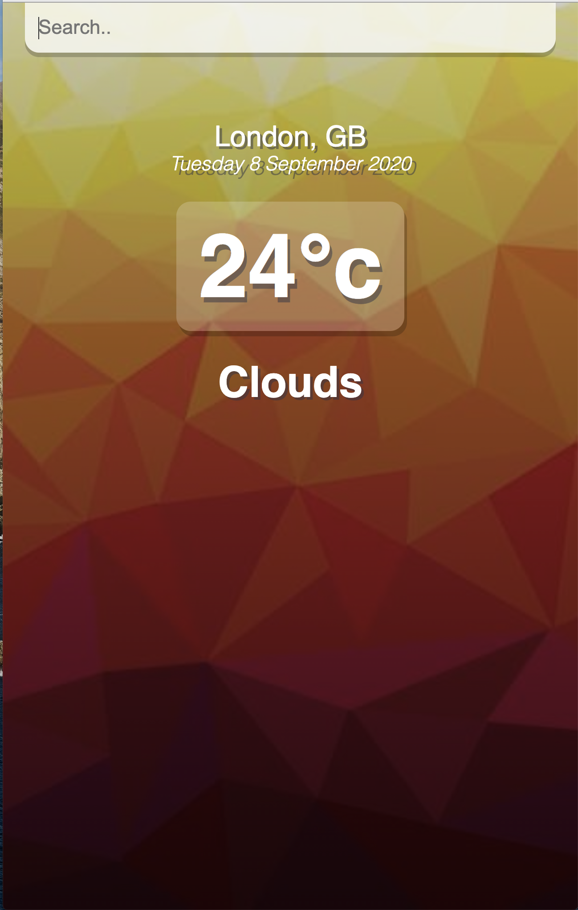
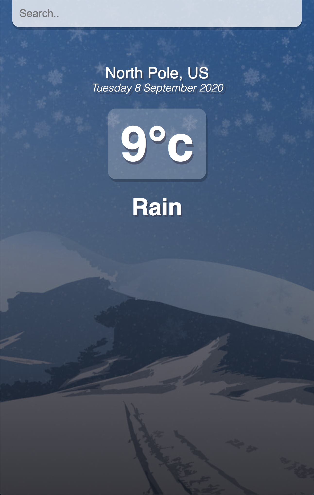

# React_Weather_App
  

## Description
This weather app was built using the React Framework alongside with the GetWeather API. My plans further down the line are to implement different backgounds for the different enviormental conditions as well as adding the 5 day forecast functionality. 

## Table of Contents
* [Description](#Description)
* [Installation](#Installation)
* [Usage](#Usage)
* [Licensing](#License)
* [Contributions](#Contributions)
* [Testing](#Tests)

## Installation

```
npm i
```

## Usage
Input city into search-bar and see what the temperature and forecast are where you're headed!




## License
MIT

## Contributions
W3Schools, Tyler Potts, Myself

## Tests
```
N/A
```

## Questions 
You can click the following link to be taken to my GitHub profile: (http://github.com./EpicGibbon)


Feel free to reach out to me with any questions or comments: [mailto:Michant1997@gmail.com]